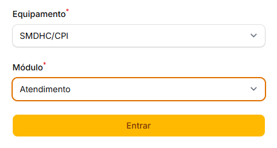

# Versão 2.0.0

A **versão 2.0.0** do SIAD marca um avanço significativo na evolução do sistema, com a introdução da funcionalidade de **Registro de Atendimentos**, ampliando sua abrangência e utilidade. Outra importante novidade é a inclusão de uma nova seção dedicada ao registro de dados relacionados à imigração, voltada especificamente para os equipamentos de atendimento a **imigrantes**.

Confira abaixo todos os detalhes dessa atualização.

## Novas funcionalidades

### Atendimentos

<figure><figcaption>
Nova funcionalidade para registro de atendimentos
</figcaption></figure>

A nova funcionalidade de registro de atendimentos representa um marco no sistema, possibilitando o registro não apenas de atendimentos individuais e coletivos, mas também de outros tipos de ações e serviços realizados, garantindo uma gestão mais completa e integrada. Contudo, por se tratar de uma funcionalidade em caráter piloto, sua implementação será realizada de forma **gradual**, permitindo ajustes e melhorias conforme as necessidades identificadas durante o processo de implantação.&#x20;


Para conferir todos os detalhes sobre essa nova funcionalidade, recomenda-se acessar a seção específica de atendimentos neste manual.


## Melhorias

### Dados de Imigração

<figure><figcaption>
Nova seção de dados de imigração
</figcaption></figure>

Foram adicionados novos campos no <mark style="background-color:purple;">Cadastro de Pessoas</mark> para coletar dados de imigração. Nesse primeiro momento, esses dados ficarão visíveis somente para equipamentos com a temática de Imigrantes.

Além disso, foi adicionado o campo <mark style="color:purple;">Nacionalidade(s)</mark> caso seja informado um <mark style="color:purple;">país de nascimento</mark> diferente de Brasil. Esse campo ficará visível para todos os equipamentos, mas será obrigatório para equipamentos de Imigrantes.


Para maiores detalhes sobre os novos campos, consulte a seção de [Dados Cadastrais](../pessoas/cadastro/dados-cadastrais.md).


### Novo tipo de contato internacional

<figure><figcaption>
Novo tipo de contato - Telefone Internacional
</figcaption></figure>

No <mark style="background-color:purple;">Cadastro de Pessoas</mark>, foi adicionado um novo tipo de contato "<mark style="color:purple;">Telefone internacional</mark>".

### Novas opções de Condição de Moradia

<figure><figcaption>
Novas opções de condição de moradia
</figcaption></figure>

Foram adicionadas as seguintes opções à lista de <mark style="color:purple;">Condição de Moradia</mark>, no <mark style="background-color:purple;">Cadastro de Pessoas</mark>:

* Cortiço;
* Hotel, Pensão e Similares;
* Local de Trabalho.

### Melhorias na pesquisa de Países e Municípios

Melhorada a pesquisa de <mark style="color:purple;">países</mark> e <mark style="color:purple;">municípios</mark> de forma a permitir a pesquisa com ou sem acentos.

Além disso, a lista de municípios passa a exibir também a sigla de <mark style="color:purple;">Estados/UF</mark>, para auxiliar no caso de municípios com mesmo nome.

### Equipamento sob Administração Direta

<figure><figcaption>
Nova opção de Administração Direta
</figcaption></figure>

Agora é possível indicar explicitamente se um equipamento está sob gestão da Administração Direta. Ao ativar essa opção, o sistema irá desativar o campo <mark style="color:purple;">Organização Responsável</mark> e passará a exibir o termo <mark style="color:blue;">Administração Direta</mark> nas telas de consulta.


A edição desse campo está restrita a usuários com permissão específica.


### Módulos habilitados por equipamento

<figure><figcaption>
Novo campo para controlar os módulos ativos por equipamento
</figcaption></figure>

No <mark style="background-color:purple;">Cadastro de Equipamentos</mark>, foi adicionado um novo campo que permite controlar quais módulos estarão disponíveis por equipamento.

Através dessa funcionalidade conseguiremos, por exemplo, liberar aos poucos a nova funcionalidade de **Atendimentos** para os equipamentos piloto.&#x20;


A edição desse campo está restrita a administradores do sistema.


### Cadastro de usuários em múltiplos equipamentos

<figure><figcaption>
Possibilidade de cadastrar um usuário em vários equipamentos
</figcaption></figure>

A partir dessa versão será possível cadastrar um usuário do sistema em mais de um equipamento, que será utilizada em cenários como funcionários que trabalham em mais de um equipamento, unidades móveis e supervisores.

Dessa forma, a <mark style="background-color:purple;">tela de login</mark> foi alterada para que o usuário indique qual equipamento deseja acessar para aquela sessão.


Uma vez selecionado um equipamento, todas as ações realizadas no sistema serão associadas ao equipamento selecionado, até que o usuário seja deslogado.



Para acessar um equipamento diferente, o usuário deverá sair do sistema primeiramente e realizar o login novamente.


### Melhorias no Cadastro de Usuários

<figure><figcaption>
Novos filtros no Cadastro de Usuários
</figcaption></figure>

Os filtros do <mark style="background-color:purple;">Cadastro de Usuários</mark> foram revisados de forma a melhorar a usabilidade por parte da equipe de gerenciamento dos acessos.


O acesso à essa funcionalidade é exclusivo dos administradores do sistema.


### Atualização do ícone de carregamento

<figure><figcaption>
Novo ícone para indicar carregamento do sistema
</figcaption></figure>

A tela de carregamento do sistema que era exibida ao preencher alguns campos do sistema foi substituída por uma indicação mais sutil ao lado do campo que está sendo carregado.


Recomendamos sempre aguardar o término do carregamento antes de proceder com as demais etapas de preenchimento.


## Ajustes

### Consulta de Endereço e Distrito

<figure><figcaption>
Ajustes na consulta de endereço
</figcaption></figure>

Quando selecionado um CEP fora de São Paulo, o sistema ocultará automaticamente o campo <mark style="color:purple;">Distrito</mark>, e passará a exibir o campo <mark style="color:green;">Cidade</mark>.

Além disso, foi adicionado um link <mark style="color:red;">Consultar endereço</mark> com alguns sites que podem auxiliar na consulta de endereços.


Em versões futuras implementaremos o preenchimento automático do <mark style="color:blue;">Distrito</mark> com base no CEP.


### Pesquisa global com número de prontuários

Corrigida a pesquisa por números de prontuários com/sem pontuação.

Agora o sistema passa a localizar números de prontuários independentemente do uso de pontuação.

### Opção "Outra" na Ligação e Relação Familiar

<figure><figcaption>
Opção Outra na ligação e relação familiar
</figcaption></figure>

Foi adicionada a opção <mark style="color:purple;">Outra</mark> nos campos <mark style="background-color:blue;">Ligação Familiar</mark> e <mark style="background-color:blue;">Relação Familiar</mark>.

Agora, os campos para especificar serão visíveis somente se selecionada essa opção.

### Histórico de acesso aos encaminhamentos

A partir dessa versão, todo o acesso de consulta a algum encaminhamento será gravado no histórico de auditoria do sistema.
