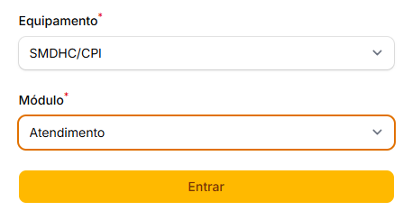

# Versão 7.0.0

A **versão 7.0.0** do SIAD é uma versão que traz melhorias e ajustes diversos.

Confira abaixo todos os detalhes dessa atualização.

## Novas Funcionalidades

### SIAD Benefícios

Foi disponibilizada uma nova funcionalidade para facilitar a gestão de programas e benefícios da SMDHC, podendo contemplar:

* Auxílio Aluguel para mulheres vítimas de violência doméstica
* Auxílio Ampara
* POT Oportunidades
* entre outros.

### SIAD Forms

Foi disponibilizada uma nova funcionalidade que permite aos Administradores criarem formulários diversos sem a necessidade de desenvolvimento, que poderão ser posteriormente utilizados em:

* Atendimentos
* Benefícios
* Editais
* Formulários públicos.

### Selo Igualdade Racial 2026

O formulário de inscrições para o Programa Selo Igualdade Racial foi reativado para receber as inscrições de 2026 (cronograma ainda a ser publicado em Edital).

## Melhorias

### Equipamentos - Inclusão de Distrito e Subprefeitura na API

Foram incluídos os campos de Distrito e Subprefeitura na API de equipamentos do SIAD.

### Formulários - Novos componentes

Foram disponibilizados os seguintes componentes para a funcionalidade de gerenciamento de atributos de formulários dinâmicos (somente admin):

* Raça/Cor
* Identidade de Gênero
* Orientação Sexual
* CPF
* Tipo de Deficiência
* País
* Município
* Condição de Moradia
* Subprefeituras
* Equipamentos
* SEI

### Infraestrutura - Melhorias de Infraestrutura e SEO

* **Well-Known URLs (W3C):** Implementadas as rotas /.well-known/change-password (redirecionando para as configurações de perfil) e /.well-known/passkey-endpoints (sinalizando a compatibilidade base) para aprimorar o suporte e a facilitação nativa de gerenciadores de senhas e passkeys.&#x20;
* **Open Graph (og:site\_name):** Adicionada a meta tag og:site\_name aos cabeçalhos globais do sistema, melhorando a identificação e a apresentação visual (prévias) do SIAD quando links são compartilhados ou interpretados por ferramentas e redes.

### Profissionais - Edição de cadastro

Foi liberada a permissão para edição do cadastro de profissionais para os equipamentos, podendo assim atualizar com informações de Ocupação e Conselho de Classe sem precisar solicitar via e-mail.

### Projetos - Áreas Corresponsáveis e Envolvidas

O cadastro de projetos e etapas foi atualizado para permitir a associação de múltiplas áreas corresponsáveis. Anteriormente, era possível vincular apenas duas áreas, e as etapas não contavam com essa funcionalidade. Além disso, foram adicionados os filtros correspondentes em todas as telas.

Também foi inserido um novo conceito de "áreas envolvidas", tanto no projeto quanto nas etapas, que permite acesso de consulta às mesmas.

### Projetos - Indicador de Subprefeitura

O indicador do tipo "Subprefeitura" foi revisado de forma a exibir uma relação completa das subprefeituras com suas respectivas métricas. Além disso, foi removida a exigência de justificativa na alteração do indicador.

### Projetos - Justificativas

A exigência de justificativa ao editar um projeto e etapa foi revisto de forma a ser exigido somente nos seguintes casos:

* Projetos: alteração do nome do projeto, área responsável, áreas corresponsáveis ou data de conclusão;
* Etapas: alteração da área responsável, áreas corresponsáveis ou data de conclusão.

### Projetos - Nome do módulo

O nome do módulo "Planejamento" foi renomeado para "Projetos".

### Projetos - Validação de datas das etapas

Foi removida a validação que impedia gravar uma etapa com data de início anterior à data de início do projeto ou com data fim posterior à data fim do projeto. Ao invés disso, será exibida uma mensagem de alerta não impeditiva, assim como a indicação de inconsistência na listagem de etapas.

### Usuários - Nova forma de login

<figure><figcaption></figcaption></figure>

A tela de login do SIAD foi alterada de forma incluir uma etapa adicional de seleção de equipamentos/módulos após autenticação, conforme mudanças abaixo:

* Todos os endereços de módulos do SIAD (ex: /atendimento, /planejamento etc.) passam a redirecionar para uma única tela de login central;
* Seletor de equipamentos passa a ser exibido somente após autenticação;
* Após selecionar o equipamento, serão exibidos os módulos que o usuário tem acesso.


Caso não seja exibido nenhum módulo após seleção do equipamento ou em caso de dúvidas, entre em contato através do e-mail **siad@prefeitura.sp.gov.br**.


### Usuários - Troca de Equipamentos e de Módulos

<figure><figcaption></figcaption></figure>

O menu de navegação superior do SIAD foi alterado da seguinte forma:

* Exibição do equipamento em que o usuário está logado;
* Funcionalidade de troca de equipamento para usuários que possem múltiplos vínculos;
* Funcionalidade de troca de módulos para usuários com permissão em múltiplos módulos do sistema.

## Ajustes

### Autenticação - Correção de erro de CPF

Corrigido erro apresentado em alguns casos quando o campo de CPF ainda não havia sido completamente exibido.

### Formulários - Correção no download de arquivos

Corrigido erro que era exibido ao tentar fazer download de anexos contendo caracteres especiais no nome do arquivo.

### Projetos - Correção das mensagens de validação

As mensagens de validação foram corrigidas de forma a exibir corretamente o nome do campo correspondente.

### Projetos - Correção de erro ao anexar planilhas

Corrigido erro que impossibilitava anexar planilhas às etapas de um projeto.

### Projetos - Correção de justificativa de edição

Corrigido problema ao justificar edição de um projeto contendo erros de validação. Ao invés de um popup, o campo de justificativa passa a ser exibido no próprio formulário de edição do projeto.

### Projetos - Correção da obrigatoriedade de campos

Foi corrigida a obrigatoriedade dos campos de objetivos estratégicos e resultados-chaves.

### Projetos - Exibição do menu de indicadores

A exibição do menu de indicadores, na ficha do projeto, foi corrigida, passando a considerar o novo relacionamento de um projeto podendo ter múltiplos resultados-chaves.

### Projetos - Remoção de alerta de anexos

Foi removido um alerta da tela de anexos que exibia orientação indevida sobre exclusão de anexos.

### Segurança - Correção de permissões

Foi corrigido o permissionamento da funcionalidade de inscrições das Eleições COMPLIR.
