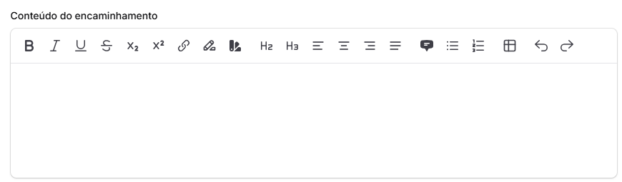

# Filtro de Texto

### Filtro de texto

Além dos filtros apresentados anteriormente, da mesma forma que na pesquisa global, também é possível pesquisar por texto no campo Pesquisar, localizado abaixo do botão Filtrar.

<figure><figcaption></figcaption></figure>

Com este filtro, é possível refinar suas pesquisas adicionando palavra complementar a uma busca. Por exemplo, você pode procurar uma pessoa por equipamento e inserir alguns filtros categóricos. Utilizando o filtro de texto, você encontra o que busca com mais facilidade, pois ele exibe apenas os resultados que contêm a palavra digitada, listando-os abaixo do filtro.

<figure><figcaption></figcaption></figure>

A vantagem de utilizar o filtro de texto é que ele permite combinar com os filtros anteriores de categorias e equipamentos, proporcionando resultados mais precisos.


Não há necessidade de clicar em nenhum botão para obter resultados do filtro de texto. Utilizando apenas os filtros anteriores e uma palavra-chave, você já terá alguns resultados listados.


