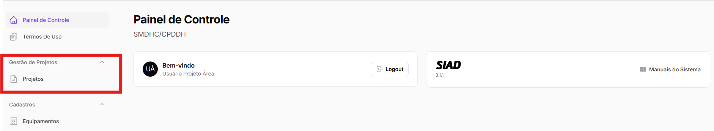

# Acesso ao sistema

## Como acessar?

Para acessar ao SIAD-Projetos, acesse o link a seguir:

> **LINK DO SIAD**

Na página principal, insira o seu login e senha.&#x20;

<mark style="background-color:yellow;">Imagem da página principal</mark>


Caso seja o seu primeiro acesso, siga as instruções em [cadastro-de-usuario.md](cadastro-de-usuario.md "mention")


Ao entrar, será redirecionado para a página "Painel de Controle".&#x20;

Por fim, clique no botão "Projetos", no menu lateral.&#x20;

<figure><figcaption></figcaption></figure>

A seguir

