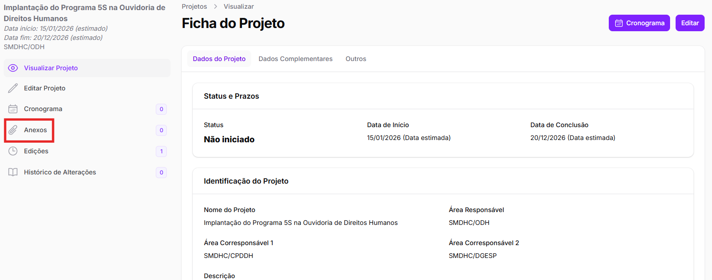
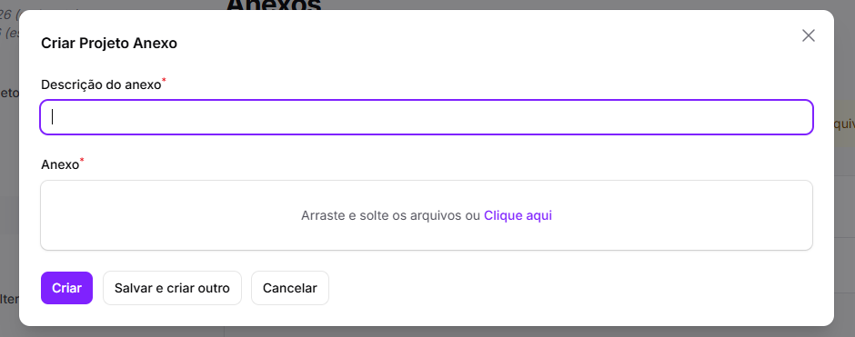
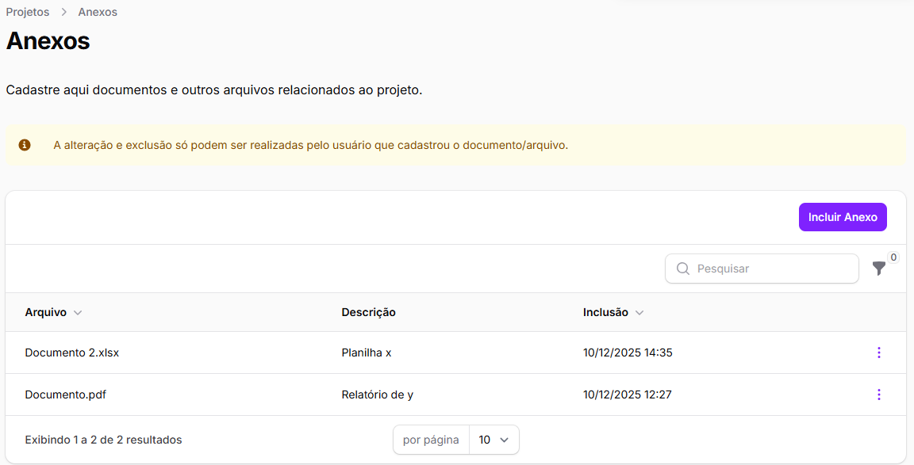
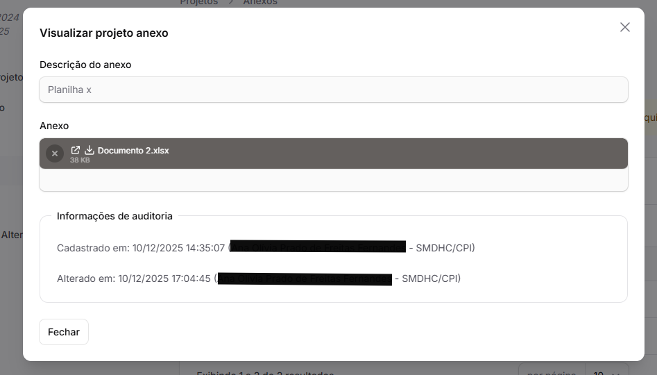
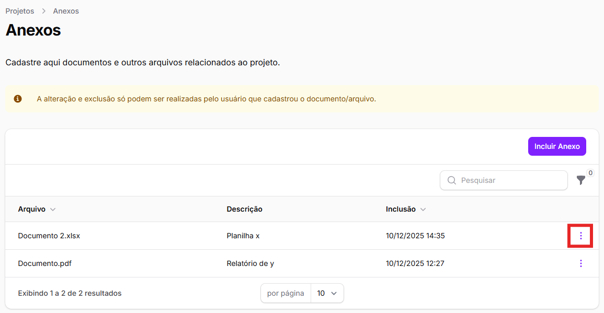
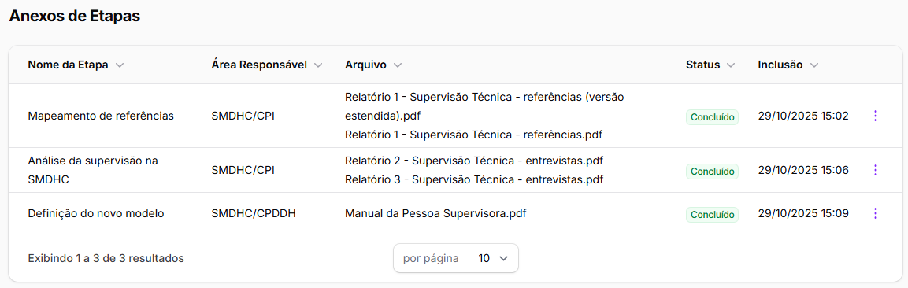
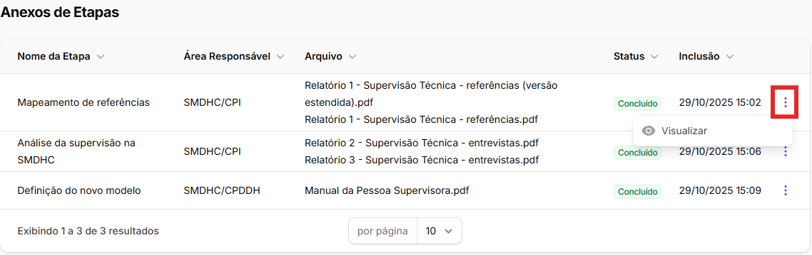

# Anexos

Já vimos que o SIAD permite que sejam anexados documentos dentro de _cada etapa_ do cronograma de um projeto. Essa explicação se encontra no final da seção [Inclusão de etapas](cronograma/inclusao-de-etapas.md).

Mas além do cadastro, do cronograma e dos anexos de cada etapa, a parte de gestão de projetos do SIAD também permite que sejam anexados documentos relacionados ao projeto como um todo.

Se trata de uma funcionalidade <mark style="background-color:yellow;">opcional</mark>, para que as áreas possam acessar recursos que facilitem a gestão de seus projetos.&#x20;

Para acessar a parte de anexos, é possível acessar a ficha do projeto desejado e clicar no botão _<mark style="color:purple;">Anexos</mark>_ no menu lateral. &#x20;

<figure><figcaption></figcaption></figure>

Também é possível acessar essa parte diretamente clicando nos 3 pontos à direita do projeto na tabela inicial e selecionando _<mark style="color:purple;">Anexos</mark>_.&#x20;

<figure><figcaption></figcaption></figure>

Após acessar a página de anexos, basta seguir o passo a passo:&#x20;

1. Clique em _<mark style="color:purple;">Incluir Anexo</mark>_;&#x20;

<figure><figcaption></figcaption></figure>

2. Arraste o documento que deseja incluir ou selecione em seus arquivos;&#x20;

<figure><figcaption></figcaption></figure>

3. Preencha a parte de descrição do anexo. Recomendamos que indique do que o documento se trata sucintamente;&#x20;
4. Para salvar o documento, é possível clicar em _<mark style="color:purple;">Criar</mark>_ ou em _<mark style="color:$info;">Salvar e criar outro</mark>_. Esse último botão salva o documento incluso e volta para o início do passo a passo, para que seja possível anexar mais de um documento.


O SIAD Projetos aceita qualquer formato de documento.&#x20;


Todos os arquivos anexados àquele projeto podem ser encontrados em uma tabela na mesma seção. Nessa tabela, há os dados básicos do documento:&#x20;

* Nome do arquivo;
* Descrição do documento; e
* Data de inclusão

<figure><figcaption></figcaption></figure>

Para abrir um documento salvo, é necessário clicar na linha do documento, e será possível fazer seu download.&#x20;

<figure><figcaption></figcaption></figure>

Também é possível visualizar, editar ou excluir um arquivo por meio dos 3 pontos no canto direito da respectiva linha.&#x20;

<figure><figcaption></figcaption></figure>


Apenas o usuário que anexou um documento pode editá-lo ou excluí-lo.&#x20;


### Anexos de Etapas

Ainda, na parte de baixo da mesma página, há uma relação de <mark style="color:$info;">Anexos de Etapas</mark>. Aqui, você conseguirá ver todos os documentos que foram anexados em _todas as etapas_ daquele projeto, separados por etapa.&#x20;

Nessa tabela, constam as seguintes informações:

* Nome da etapa à qual o documento foi anexado;
* Área responsável pela etapa;
* Nome do(s) arquivo(s) anexado(s);
* Status da etapa; e
* Data de inclusão do documento

<figure><figcaption></figcaption></figure>

Para abrir um documento salvo, é possível clicar na linha do documento. Isso abrirá o mesmo pop-up do cadastro e da visualização da etapa e, assim, também será possível fazer o download do arquivo.&#x20;

<figure><figcaption></figcaption></figure>

Também é possível visualizar um arquivo por meio dos 3 pontos no canto direito da respectiva linha.&#x20;

<figure><figcaption></figcaption></figure>

x
