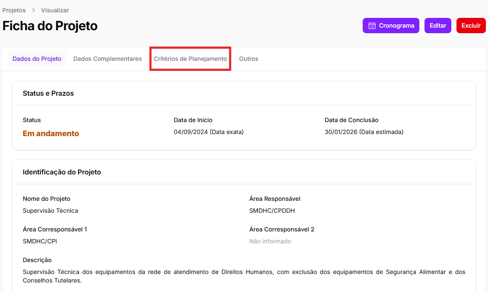

# Cadastro de projetos

### Iniciando o cadastro&#x20;

Para começar o cadastro de um novo projeto, basta clicar no botão "**Cadastrar Projeto",** que pode ser encontrado no canto superior direito da página "Lista de Projetos".&#x20;

<figure><figcaption></figcaption></figure>

Ao clicar no botão, você será redirecionado para a tela **“Cadastrar Projeto”**, que contém três abas:&#x20;

* Dados do Projeto;&#x20;
* Dados Complementares; e
* Outros&#x20;

<figure><figcaption></figcaption></figure>

É importante destacar que as abas devem ser preenchidas nessa ordem, só podendo passar para a próxima depois de preencher completar todos os seus campos obrigatórios. Contudo, é possível retornar a uma das abas preenchidas para editá-la. &#x20;


Os projetos cadastrados pela área não poderão ser editados ou visualizados pelas outras áreas, a não ser pelas áreas que também sejam corresponsáveis pelo projeto ou por áreas específicas, quais sejam: Gabinete, CPDDH e CPI.


A seguir, abordaremos os conteúdos de cada aba.&#x20;
