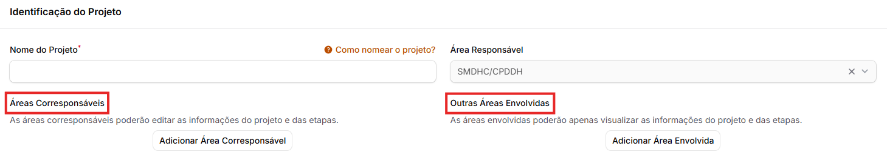

# Dados do projeto

### O que é a aba "Dados do Projeto"?

A aba “**Dados do projeto**” serve para a inserção dos dados básicos do projeto. Ela está dividida em quatro seções:&#x20;

* Identificação do projeto;&#x20;
* Responsáveis;&#x20;
* Processo SEI; e&#x20;
* Status e prazos&#x20;

Todos os campos de preenchimento contam com uma explicação e instruções para preenchimento, que podem ser acessadas por meio do botão ao lado de cada campo. Por exemplo:&#x20;

<figure><figcaption></figcaption></figure>

Ao clicar no botão, um texto explicativo aparecerá:

<figure><figcaption></figcaption></figure>

É importante destacar que existem dois campos preenchidos _automaticamente_:&#x20;

* O campo “**Área Responsável**”: preenchido com a área que o usuário indicou no formulário de cadastro de usuários do SIAD-Projetos;&#x20;
* Os campos “**E-mail do responsável principal**” e “**E-mail do responsável suplente**”: preenchidos com o e-mail vinculado ao usuário da pessoa apontada como responsável em algum dos dois campos.&#x20;

Há ainda os campos "**Áreas Corresponsáveis**" e "**Outras Áreas Envolvidas**".&#x20;

<figure><figcaption></figcaption></figure>

As áreas corresponsáveis poderão _editar_ e/ou _excluir_ as informações do projeto e das etapas. Assim, você deve selecionar como área corresponsável apenas aquelas que realmente devam ter acesso completo ao projeto.&#x20;

Já as áreas envolvidas poderão apenas _visualizar_ as informações, mas não poderão editá-las nem excluí-las. Essa opção é relevante, especialmente quando você precisar que as áreas apenas tenham acesso rápido a um documento ou a um link, por exemplo, mas sem dar acesso completo.&#x20;


O usuário que realiza o cadastro de um projeto não precisa ser o responsável (principal ou suplente) pelo projeto. No entanto, para que uma pessoa seja apontada com responsável por um projeto, ela deve ter um cadastro no SIAD-Projetos.


Além disso, há um campo "**O projeto tem relação com os resultados-chave do Planejamento Estratégico da SMDHC?**".&#x20;

Ao selecionar "Sim", você deve obrigatoriamente indicar quais são o Objetivo Estratégico e o Resultado-Chave relacionados àquele projeto.

Caso a área possua dúvidas se o projeto em questão tem relação com o Planejamento Estratégico ou caso a área ainda não tenha realizado reunião com a CPI sobre o Planejamento Estratégico, entrem em contato com a equipe de Planejamento da CPI.&#x20;

<figure><figcaption></figcaption></figure>

A seguir, as instruções sobre a aba "**Dados Complementares**".
