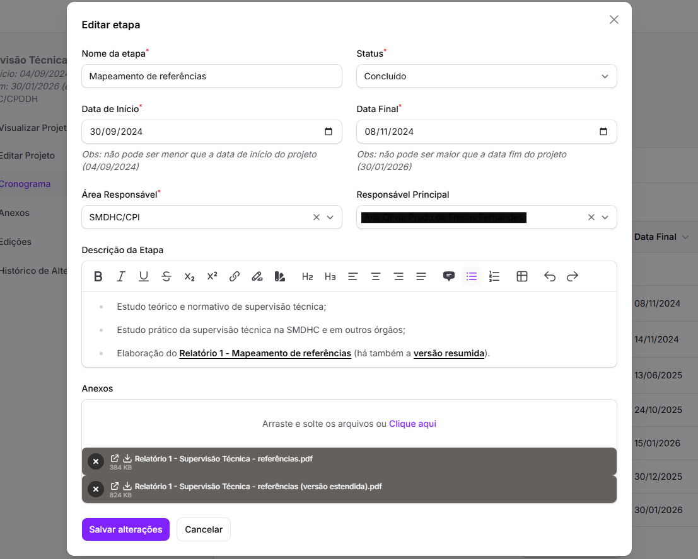
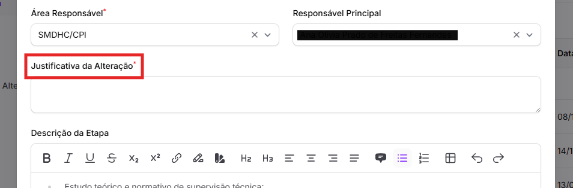

# Edição de etapas

As etapas de um projeto podem ser editadas pelas áreas responsáveis pelo projeto ou pela área responsável apenas por aquela etapa.&#x20;

Para editar qualquer informação de uma etapa, basta clicar nos 3 pontos no canto direito da linha da etapa e clicar em _<mark style="color:purple;">Editar</mark>_. &#x20;

<figure><figcaption></figcaption></figure>

Esse botão abre o mesmo pop-up do cadastro da etapa, e é possível editar todos os campos referentes à etapa, por meio da lista suspensa destacada abaixo.&#x20;

<figure><figcaption></figcaption></figure>

Qualquer alteração em qualquer um dos campos básicos exigirá uma **justificativa**, que aparecerá automaticamente para preenchimento.

<figure><figcaption></figcaption></figure>

Os únicos campos que podem ser alterados livremente sem justificativa são os campos de _<mark style="color:$info;">Descrição da Etapa</mark>_ e de _<mark style="color:$info;">Anexos</mark>_.

Após alterar as informações, é necessário clicar em _<mark style="color:purple;">Salvar alterações</mark>_ para salvar a mudança.
