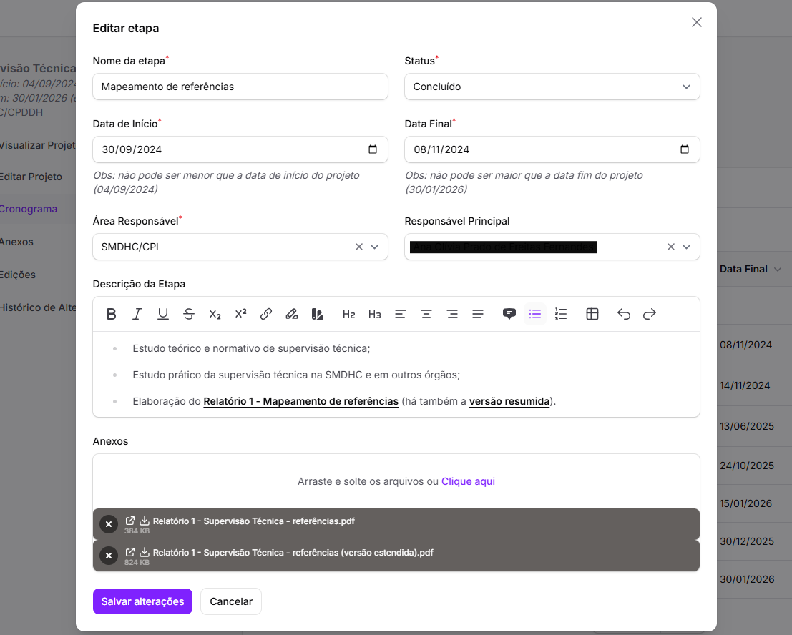
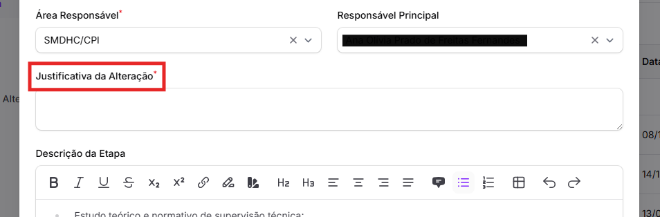

# Edição de etapas

As etapas de um projeto podem ser editadas pelas áreas responsáveis pelo projeto ou pela área responsável apenas por aquela etapa.&#x20;

Para editar qualquer informação de uma etapa, basta clicar nos 3 pontos no canto direito da linha da etapa e clicar em _<mark style="color:purple;">Editar</mark>_. &#x20;

<figure><figcaption></figcaption></figure>

Esse botão abre o mesmo pop-up do cadastro da etapa, e é possível editar todos os campos referentes à etapa, por meio da lista suspensa destacada abaixo.&#x20;

<figure><figcaption></figcaption></figure>

Caso seja feita alguma alteração nos campos de _<mark style="color:$info;">Área Responsável</mark>_ ou _<mark style="color:$info;">Data Final</mark>_, um campo para **justificativa** aparecerá automaticamente para preenchimento. Os outros campos podem ser alterados livremente, sem necessidade de justificar.&#x20;

<figure><figcaption></figcaption></figure>

Além disso, é possível excluir os anexos da etapa, clicando no x à esquerda do anexo que se deseja excluir.

<figure><figcaption></figcaption></figure>

Após alterar as informações, é necessário clicar em _<mark style="color:purple;">Salvar alterações</mark>_ para salvar a mudança.
