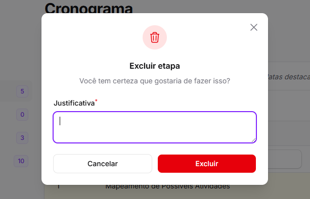
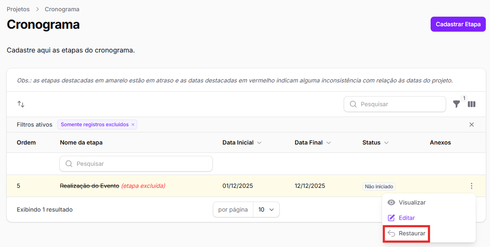

# Exclusão de etapas

O usuário poderá excluir as **etapas** pelas quais sua área seja **responsável ou corresponsável**, além das etapas dos **projetos** pelos quais sua área seja a **área responsável ou corresponsável**. Se sua área é envolvida, a exclusão não será possível.

Para excluir uma etapa de um projeto salvo no SIAD, você deve:

1. Selecionar a linha do projeto na tabela inicial (o que abrirá a Ficha do Projeto) e clicar em _<mark style="color:purple;">Cronograma</mark>_, no canto superior direito ou no menu esquerdo da tela.&#x20;

<figure><figcaption></figcaption></figure>

2. Clicar nos 3 pontos no canto direito da linha da etapa que deseja excluir e clicar em _<mark style="color:red;">Excluir</mark>_.

<figure><figcaption></figcaption></figure>

Ao selecionar esse botão, é obrigatório informar uma **justificativa** para a exclusão.

<figure><figcaption></figcaption></figure>

Após informar a justificativa, basta clicar em _<mark style="color:red;">Excluir</mark>_.

## Como recuperar uma etapa após sua exclusão?

Caso tenha excluído uma etapa de um projeto e precise recuperá-la, basta clicar no botão "**Filtrar**" no Cronograma e filtrar pelas etapas excluídas, selecionando _<mark style="color:$info;">Exibir registros excluídos</mark>_ ou _<mark style="color:$info;">Somente registros excluídos</mark>_.

<figure><figcaption></figcaption></figure>

Também é possível acessar esse mesmo filtro na Lista de Etapas.

<figure><figcaption></figcaption></figure>

Ao localizar a etapa excluída que deseja recuperar, basta clicar nos 3 pontos no canto direito da linha (da tabela inicial de etapas ou do cronograma) e clicar em _<mark style="color:$info;">⮌</mark>_ _<mark style="color:$info;">Restaurar</mark>_.

<figure><figcaption></figcaption></figure>
