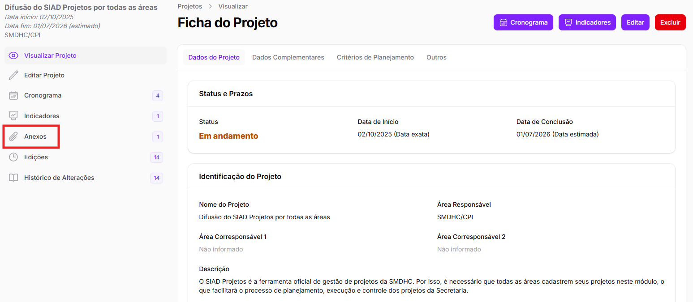

# Inclusão de etapas

Para cadastrar a etapa de um projeto, acesse o cronograma e clique no botão _<mark style="color:purple;">Cadastrar Etapa</mark>_.&#x20;

<figure><figcaption></figcaption></figure>

Após clicar no botão, aparecerá um pop-up na tela com algumas informações necessárias sobre a etapa. São elas:

* Nome da etapa;
* Status;
* Data de Início;
* Data Final;
* Área Responsável;
* Responsável Principal;
* Áreas Corresponsáveis;
* Áreas Envolvidas;
* Descrição da Etapa; e
* Anexos


Os campos de preenchimento obrigatório são: Nome da etapa, Status, Data de Início, Data Final e Área Responsável.


<figure><figcaption></figcaption></figure>


Caso sejam inseridas datas que estejam fora da data prevista para o projeto, aparecerá um aviso, recomendando que as datas do projeto sejam atualizadas.&#x20;


Um dos campos obrigatórios é o de _<mark style="color:$info;">Status</mark>_, que terá que ser atualizado conforme o andamento do projeto.&#x20;

Os status definidos para as etapas do cronograma são:&#x20;

* Não Iniciado
* Em Andamento
* Travado
* Concluído


É obrigatório informar o motivo pelo qual uma etapa é marcada com o status “Travado”:


<figure><figcaption></figcaption></figure>

Ainda, há os campos de _<mark style="color:$info;">Área Responsável</mark>_ e _<mark style="color:$info;">Responsável Principal</mark>_.&#x20;

Importante apontar que a _<mark style="color:$info;">Área Responsável</mark>_ não precisa ser necessariamente a área que cadastrou o projeto nem uma área corresponsável do projeto, pode ser **qualquer área**.&#x20;

Isso porque pode ser que uma área seja responsável apenas por uma única etapa do projeto.&#x20;


**Exemplo:** em um projeto no qual a CPI é a área responsável e a CPDDH é uma área corresponsável, pode haver uma etapa específica de responsabilidade da Assessoria Jurídica (AJ). Nesse cenário, CPI e CPDDH – por serem áreas responsáveis – poderão visualizar e editar todo o projeto e todas as etapas. Já a AJ, por ser responsável apenas por uma etapa específica, terá permissão de visualizar e editar _exclusivamente_ essa etapa.


Além disso, da mesma forma que nos dados do projeto, há ainda a opção de incluir _<mark style="color:$info;">Áreas Corresponsáveis</mark>_ pela etapa (que poderão editá-la ou excluí-la) e _<mark style="color:$info;">Áreas Envolvidas</mark>_ (que poderão apenas visualizar a etapa).&#x20;

Por fim, o SIAD permite que sejam anexados documentos relacionados à etapa. É uma funcionalidade <mark style="background-color:yellow;">opcional</mark>, para que as áreas possam acessar recursos que facilitem a gestão do cronograma de seus projetos.

Basta, no campo indicado, arrastar o documento que deseja incluir ou selecionar em seus arquivos.

Todos os anexos incluídos em etapas poderão ser visualizados clicando em "Anexos", no menu lateral esquerdo. Para detalhes dessa visualização, acesse a página [Anexos](../anexos.md).

<figure><figcaption></figcaption></figure>

Além dos anexos das etapas, há como incluir anexos do projeto como um todo. Também para mais informações, acesse a página de [Anexos](../anexos.md).

Após o preenchimento, é possível clicar em _<mark style="color:purple;">Criar</mark>_ para salvar a etapa ou em _<mark style="color:$info;">Salvar e criar outro</mark>_ para salvar a etapa e adicionar uma nova em sequência.&#x20;
