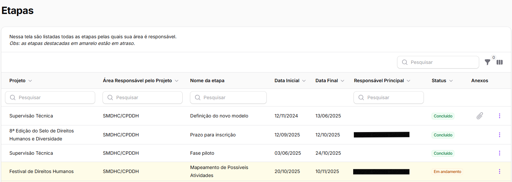
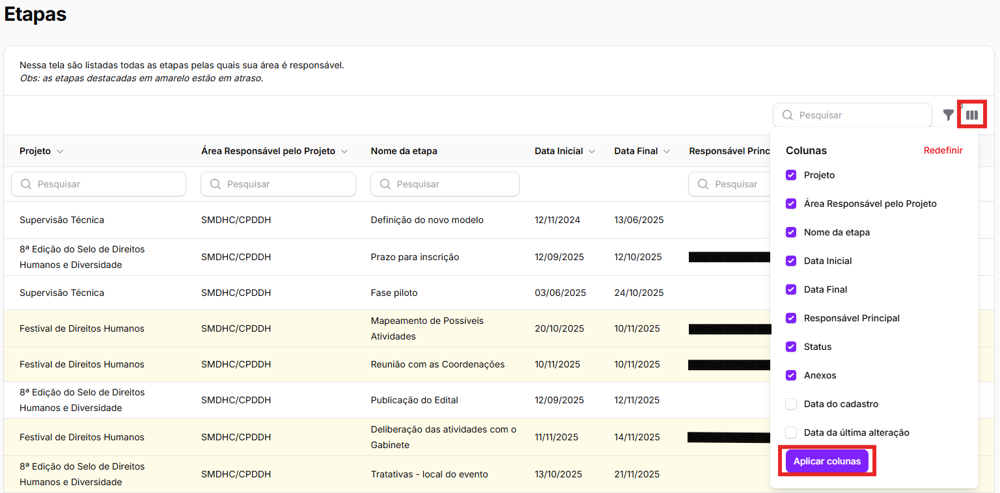
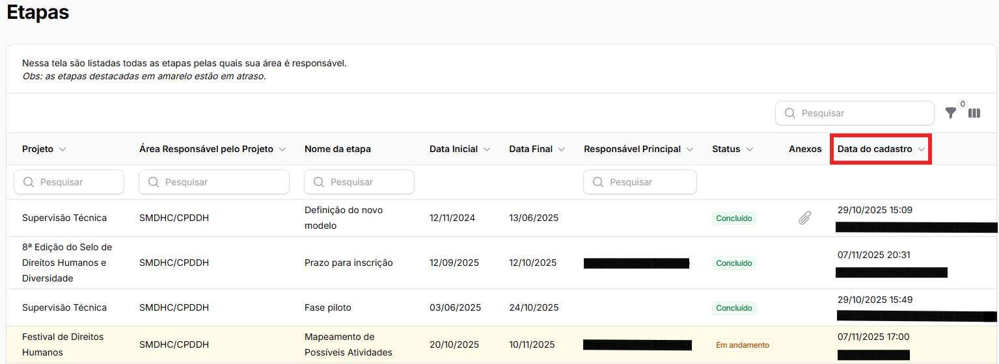
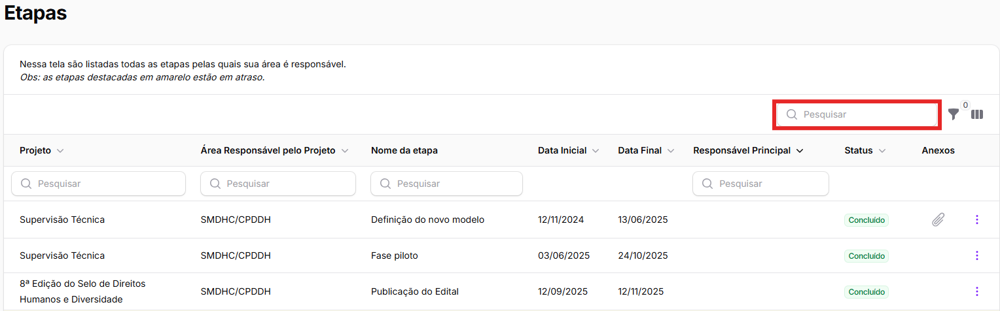
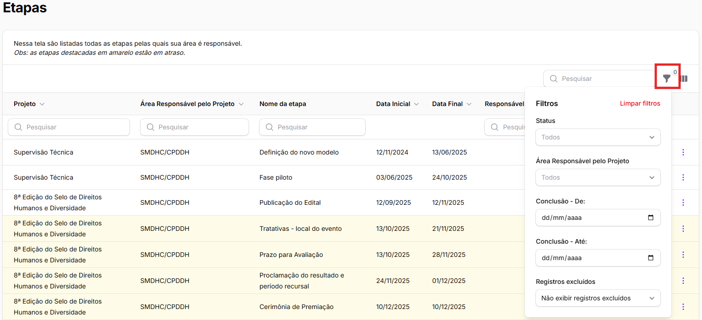
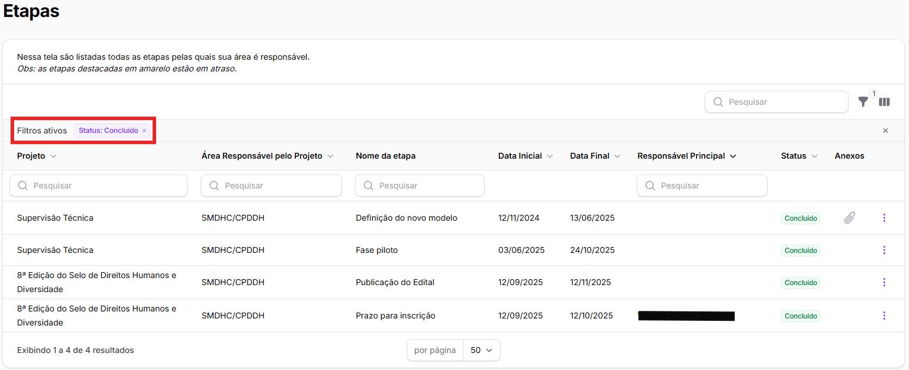

# Lista de etapas

### O que é a lista de etapas?

Da mesma forma que a Lista de Projetos, a página "**Etapas**" reúne todos as etapas que tenham a área como **responsável** e as suas principais informações, para uma visão global das etapas.&#x20;

Ela é acessada clicando em "Etapas", no menu esquerdo da tela.&#x20;

<figure><figcaption></figcaption></figure>

As etapas e suas informações estão em formato de tabela, conforme a imagem abaixo.

<figure><figcaption></figcaption></figure>

Ainda, como indicado no início da tela, as etapas destacadas em <mark style="background-color:yellow;">amarelo</mark> estão em atraso. Isso facilita a visualização.&#x20;

A critério do usuário, é possível adicionar colunas na tabela e aplicar ferramentas de busca e filtragem de etapas. A seguir, explicaremos cada uma dessas funcionalidades.

### Informações disponíveis na lista de etapas

Como pode ser visto na imagem, a tabela com a lista de etapas estará sempre acompanhada das colunas:

* Projeto;
* Área Responsável pelo Projeto;&#x20;
* Nome da etapa;
* Data Inicial;
* Data Final;
* Responsável Principal (pela etapa);
* Status; e
* Anexos

Além dessas, é possível incluir as seguintes colunas clicando no botão mais à direita ao lado do campo de pesquisa:

* Data do cadastro; e
* Data da última alteração

<figure><figcaption></figcaption></figure>

Por exemplo, quando selecionamos o item "Data do cadastro", a tabela de etapas ficará da seguinte forma:

<figure><figcaption></figcaption></figure>

### Filtro das etapas

É possível pesquisar pela etapa desejada por meio de seu nome, do nome do projeto, do nome do responsável principal ou do nome da área responsável pelo projeto na barra de pesquisa localizada na parte superior direita da tabela inicial.&#x20;

<figure><figcaption></figcaption></figure>

Além da pesquisa, é possível utilizar os filtros para selecionar quais projetos aparecerão na lista.&#x20;

<figure><figcaption></figcaption></figure>


Quanto mais etapas pelas quais a área seja responsável, mais importante a utilização de filtros para que seja possível localizar as etapas relevantes para aquele momento.&#x20;


Ao clicar no botão **"Filtrar"**, o usuário possui à disposição os seguintes filtros:

* **Status** – filtra por meio do status da etapa inserido pela área durante o cadastro da etapa. É possível selecionar mais de uma opção;&#x20;
* **Área Responsável pelo Projeto** – filtra por meio da área responsável pelo projeto. É possível selecionar mais de uma opção;
* **Conclusão** – filtra as etapas dentro de um período de datas de conclusão da etapa, mostrando na tabela apenas as que serão concluídos dentro dessa margem;&#x20;
* **Registros excluídos** – quando uma etapa é excluída, ela deixa de aparecer na tela principal de etapas. No entanto, por meio desse filtro, é possível mostrá-las selecionando “Exibir registros excluídos” ou “Somente registros excluídos”  (essa explicação está mais detalhada no item [Exclusão de etapas](exclusao-de-etapas.md));

Por exemplo, quando filtramos pelo status e selecionamos apenas as etapas com status "Concluído", a tabela ficará da seguinte forma:&#x20;

<figure><figcaption></figcaption></figure>
