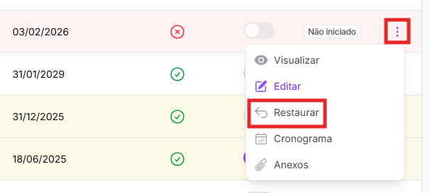

# Edição de projetos cadastrados

Caso precise alterar alguma informação no cadastro de projetos ou atualizar seu status de andamento, é possível seguir três caminhos:&#x20;

1. Selecionar a linha do projeto na tabela inicial (abrindo a Ficha do Projeto) e clicar em _<mark style="color:purple;">Editar projeto</mark>_ no menu lateral, à esquerda da tela;&#x20;

<mark style="color:yellow;">Imagem da página (esperar atualização em produção)</mark>

2. Selecionar a linha do projeto na tabela inicial (abrindo a Ficha do Projeto) e clicar no botão _<mark style="color:purple;">Editar</mark>_, no canto superior direito da tela;&#x20;

<mark style="color:yellow;">Imagem da página (esperar atualização em produção)</mark>

2. Clicar nos 3 pontos no canto direito da linha da tabela inicial e clicar em _<mark style="color:purple;">Editar</mark>_.&#x20;

<figure><figcaption></figcaption></figure>

Depois, basta alterar as informações desejadas e selecionar o botão _<mark style="color:purple;">Salvar</mark>_, na parte de baixo da tela. &#x20;

<figure><figcaption></figcaption></figure>

Ao selecionar esse botão, é obrigatório informar uma **justificativa** para as alterações. Essa etapa é importante para que seja possível um acompanhamento mais detalhado do projeto.&#x20;


Não é possível editar os campos _Nome_ e _Área Responsável_.&#x20;


Após informar a justificativa, basta clicar em _<mark style="color:purple;">Enviar</mark>_ e as alterações serão salvas.&#x20;

<figure><figcaption></figcaption></figure>

Caso queira abandonar o processo de edição sem salvar as alterações, basta clicar em _<mark style="color:purple;">Cancelar</mark>_, ao lado do botão _<mark style="color:purple;">Salvar</mark>_.&#x20;

<figure><figcaption></figcaption></figure>
