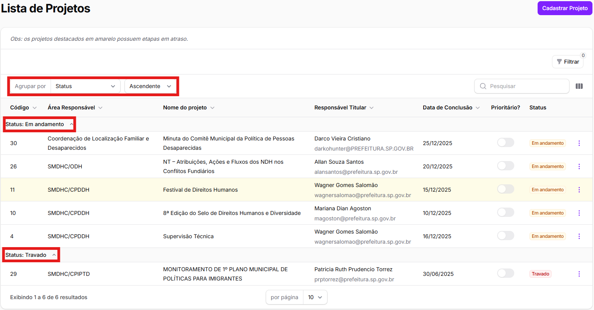

# Exclusão de projetos cadastrados

O usuário poderá excluir apenas os projetos pelos quais sua área seja a **área responsável**. Se sua área é corresponsável por um projeto, a exclusão não será possível.&#x20;

Para excluir um projeto salvo no SIAD, há dois caminhos:&#x20;

1. Clicar nos 3 pontos no canto direito da linha do projeto na tabela inicial e clicar em _<mark style="color:red;">Excluir</mark>_.&#x20;

<figure><figcaption></figcaption></figure>

2. Selecionar a linha do projeto na tabela inicial (o que abrirá a Ficha do Projeto) e clicar em _<mark style="color:red;">Excluir</mark>_, no canto superior direito da tela;&#x20;

<figure><figcaption></figcaption></figure>

Ao selecionar esse botão, é obrigatório informar uma **justificativa** para a exclusão.

<figure><figcaption></figcaption></figure>

Após informar a justificativa, basta clicar em _<mark style="color:red;">Excluir</mark>_.&#x20;

## Como recuperar um projeto após sua exclusão?

Caso tenha excluído um projeto e precise recuperá-lo, basta clicar no botão "**Filtrar**" na tabela inicial e filtrar pelos projetos excluídos, selecionando _<mark style="color:$info;">Exibir registros excluídos</mark>_.&#x20;

<figure><figcaption></figcaption></figure>

Ao localizar o projeto excluído que deseja recuperar, basta clicar nos 3 pontos no canto direito da linha da tabela inicial de projetos e clicar em _<mark style="color:$info;">⮌</mark>_ _<mark style="color:$info;">Restaurar</mark>_.&#x20;

<figure><figcaption></figcaption></figure>
