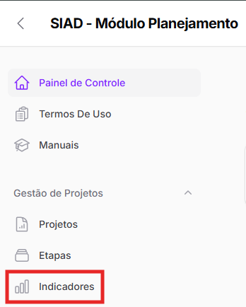
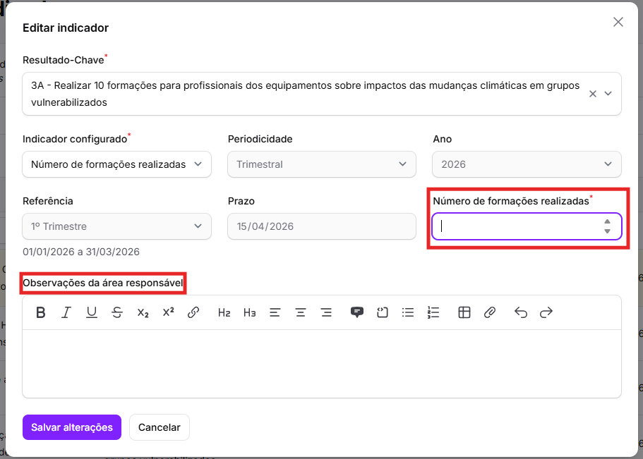

# Indicadores

_<mark style="background-color:yellow;">Página em construção</mark>_

Além da possibilidade de cadastrar etapas e anexar documentos, há uma outra funcionalidade da parte de gestão de projetos do SIAD: o cadastro de indicadores.&#x20;

Os indicadores são métricas utilizadas para avaliar o desempenho, o progresso e o alcance de objetivos. No caso da SMDHC, métricas que avaliam o progresso de projetos relacionados a resultados e objetivos específicos.&#x20;

A página "**Indicadores**" é acessada clicando no botão respectivo no menu esquerdo da tela.&#x20;

<figure><figcaption></figcaption></figure>

Ao clicar, aparecerá a Lista de Indicadores, com todos os indicadores dos projetos pelos quais sua área é responsável ou corresponsável.&#x20;

<figure><figcaption></figcaption></figure>


Por enquanto, apenas os projetos relacionados ao **Planejamento Estratégico** da SMDHC possuem indicadores cadastrados. Porém, a ideia é que, com o tempo, sejam cadastrados indicadores para _todos_ os projetos que possuem algum.


A CPI é quem irá cadastrar todos os indicadores, e há indicadores com diversas periodicidades – mensal, bimestral, trimestral, semestral ou anual.&#x20;

Ao final de cada _mês_, as áreas devem apenas acessar a Lista de Projetos e preencher seus indicadores de periodicidade _mensal_ (se houver), que já terão sido cadastrados pela CPI.&#x20;

O mesmo acontecerá ao final de cada bimestre, trimestre, semestre e ano.&#x20;

Por exemplo: o resultado-chave 3A do Planejamento Estratégico ("_Realizar 10 formações para profissionais dos equipamentos sobre impactos das mudanças climáticas em grupos vulnerabilizados_") possui um indicador: "Número de formações realizadas" e esse indicador é trimestral.&#x20;

Se a sua área possuir um projeto (ou mais de um) relacionado a este resultado-chave, você (ou a pessoa responsável na sua área) precisará **preencher periodicamente o indicador** relacionado.&#x20;

Isso significa que, ao final de cada trimestre, a área deve acessar a Lista de Indicadores e preencher este indicador (que já terá sido cadastrado pela CPI) para cada um de seus projetos que estejam relacionados ao resultado 3A.

Ao clicar em cima da linha do indicador, aparecerá um pop-up para esse preenchimento. A tela trará algumas informações:&#x20;

* Resultado-Chave
* Indicador configurado
* Periodicidade
* Ano
* Referência
* Prazo
* Indicador
* Observações da área responsável

Os únicos campos que estarão abertos para preenchimento serão o do **indicador** e o de **observações**:&#x20;

<figure><figcaption></figcaption></figure>

Assim, neste exemplo, basta que a área informe o número de formações realizadas no 1º trimestre do ano de 2026, forneça, se quiser, mais informações na área de observações (como local e data da formação, por exemplo) e clique em _<mark style="color:purple;">Salvar alterações</mark>_.&#x20;
