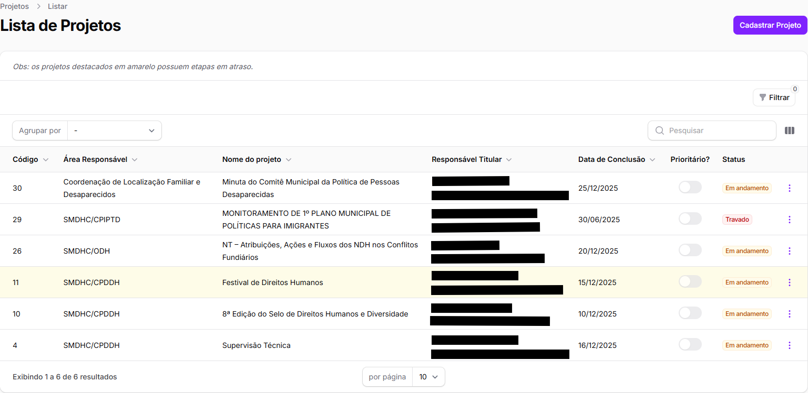
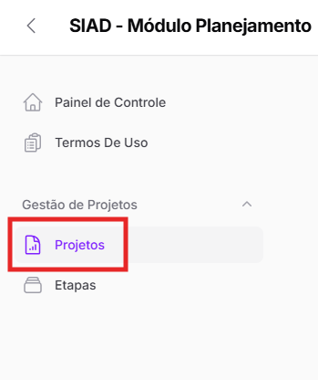
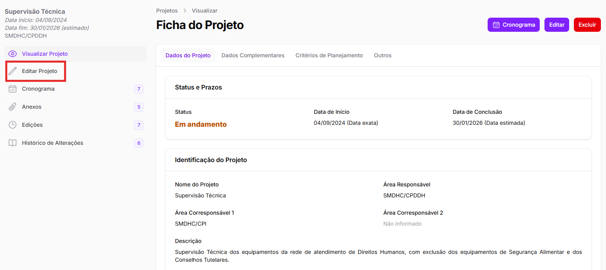
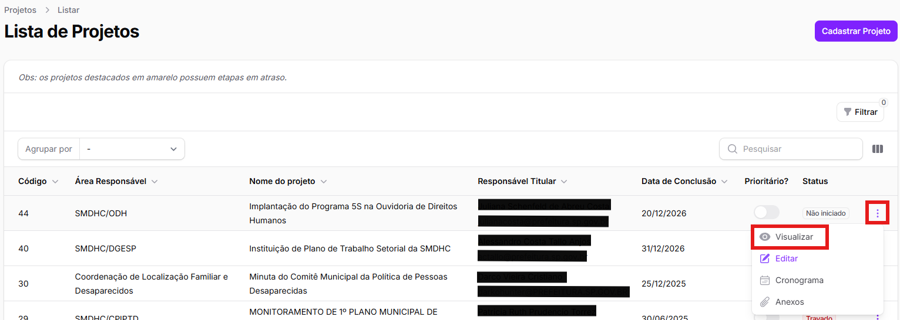
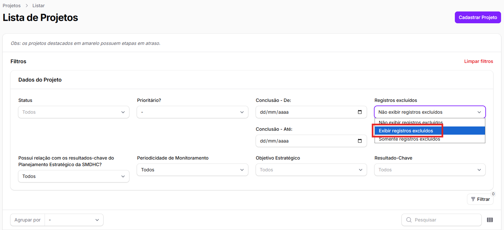
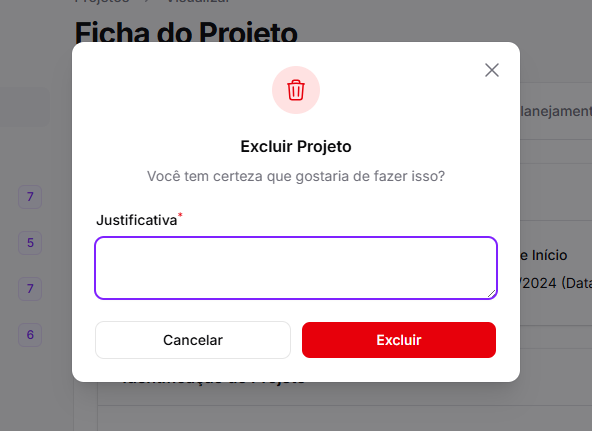

# Lista de Projetos

### O que é a "Lista de Projetos"?

A página "**Lista de Projetos**" reúne todos os projetos **cadastrados pela área** ou que tenham a área como **corresponsável** pelo projeto e as suas principais informações, para uma visão global dos seus projetos.&#x20;

Os projetos e suas informações estão em formato de tabela, conforme a imagem abaixo.

<figure><figcaption></figcaption></figure>

Ainda, como indicado no início da tela, os projetos destacados em <mark style="background-color:yellow;">amarelo</mark> possuem etapas em atraso. Isso facilita a visualização.&#x20;

Explicaremos como acessar as informações detalhadas dos projetos em [ficha-do-projeto.md](ficha-do-projeto.md "mention").&#x20;

A critério do usuário, é possível adicionar colunas na tabela e aplicar ferramentas de busca, filtragem e agrupação de projetos. A seguir, explicaremos cada uma dessas funcionalidades.

### Informações disponíveis na lista de projetos

A tabela com a lista de projetos estará sempre acompanhada das colunas:

* Código do projeto;
* Área responsável;&#x20;
* Nome do projeto;
* Responsável titular;
* Data de conclusão do projeto;
* Se é prioritário; e
* Status indicado pela área

<figure><figcaption></figcaption></figure>

Além dessas, é possível incluir as seguintes colunas clicando no botão ao lado do campo de pesquisa:

* Área Corresponsável (1 e 2);&#x20;
* Responsável Suplente;
* Data de Início;
* Possui relação com os resultados-chave do Planejamento Estratégico da SMDHC?;
* Objetivo Estratégico;
* Resultado-Chave; &#x20;
* Processo SEI;
* Periodicidade de Monitoramento;&#x20;
* Data do cadastro; e
* Data da última alteração

Por exemplo, quando selecionamos os itens "Área Corresponsável 1" e "Data do cadastro", a tabela de projetos ficará da seguinte forma:

<figure><figcaption></figcaption></figure>

### Filtro e Agrupamento dos projetos

É possível pesquisar pelo projeto desejado por meio de seu nome, do nome do responsável principal ou pelo código do projeto na barra de pesquisa localizada na parte superior direita da tabela inicial.&#x20;

<figure><figcaption></figcaption></figure>

Além da pesquisa, é possível utilizar os filtros para selecionar quais projetos aparecerão na lista.&#x20;

<figure><figcaption></figcaption></figure>


Quanto mais projetos cadastrados pela área, mais importante a utilização de filtros para que seja possível localizar os projetos relevantes para aquele momento.&#x20;


Ao clicar no botão **"Filtrar"**, o usuário possui à disposição os seguintes filtros:

* **Status** – filtra por meio do status do projeto inserido pela área durante o cadastro do projeto. É possível selecionar mais de uma opção;&#x20;
* **Prioritário?** – filtra apenas os projetos marcados como prioritários ou não, decorrente de decisão do gabinete;&#x20;
* **Conclusão** – filtra os projetos dentro de um período de datas de conclusão do projeto, mostrando na tabela apenas os que serão concluídos dentro dessa margem;&#x20;
* **Registros excluídos** – quando um projeto é excluído, ele deixa de aparecer na tela principal de projetos. No entanto, por meio desse filtro, é possível mostrá-los selecionando “Exibir registros excluídos” ou “Somente registros excluídos”;
* **Possui relação com os resultados-chave do Planejamento Estratégico da SMDHC?** – filtra apenas os projetos que possuem relação direta (ou não) com o Planejamento Estratégico;
* **Periodicidade de Monitoramento** – filtra os projetos a partir de sua periodicidade de monitoramento, para aqueles que possuem periodicidade definida;&#x20;
* **Objetivo Estratégico** – filtra todos os projetos relacionados ao mesmo Objetivo Estratégico do Planejamento Estratégico. É possível selecionar mais de uma opção;
* **Resultado-Chave** – filtra todos os projetos relacionados ao mesmo resultado-chave do Planejamento Estratégico. É possível selecionar mais de uma opção.

Por exemplo, quando filtramos pelo status e selecionamos apenas os projetos com status "Travado", a tabela ficará da seguinte forma:&#x20;

<figure><figcaption></figcaption></figure>

Ainda, é possível agrupar os projetos conforme os status ou a área, tanto em ordem crescente quanto decrescente. Para isso, clique no botão "Agrupar por" no canto esquerdo da tabela:

<figure><figcaption></figcaption></figure>

Feita a apresentação da página **"Lista de Projetos",** agora é o momento de apresentar como se cadastra um projeto no SIAD-Projetos.&#x20;

###
