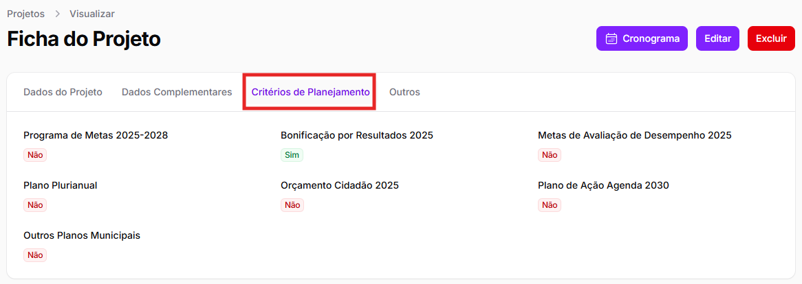

# Priorização

Além da gestão de projetos, o módulo planejamento visa facilitar o processo de priorização dos projetos das áreas da SMDHC. Nessa seção, serão explicadas as funcionalidades desenvolvidas para esse processo.&#x20;

Vale destacar que esse processo será realizado entre **CPI** e **CPDDH** junto com o **Gabinete** da secretaria. &#x20;

## Critérios de Planejamento

Com a inclusão do projeto pelas áreas, CPI complementará o cadastro indicando se incidem sobre o projeto os compromissos decorrentes dos instrumentos de planejamento da Secretaria e da Prefeitura. Essas informações, uma vez preenchidas por CPI, aparecerão para as áreas como uma aba na ficha, chamada _<mark style="color:$info;">Critérios de Planejamento</mark>_.

<figure><figcaption></figcaption></figure>

Além dos instrumentos verificados na aba de Critérios de Planejamento, há outro instrumento de planejamento considerado para a priorização de projetos, que é o **Planejamento Estratégico da SMDHC**. Essa informação consta na aba de _<mark style="color:$info;">Dados do Projeto</mark>_.&#x20;


Assim, os instrumentos de planejamento verificados são:&#x20;

1. Programa de Metas;&#x20;
2. Bonificação por Resultados;&#x20;
3. Metas de Avaliação de Desempenho;&#x20;
4. Plano Plurianual;&#x20;
5. Orçamento Cidadão;&#x20;
6. Plano de Ação Agenda 2030;&#x20;
7. Outros Planos Municipais;
8. Planejamento Estratégico da SMDHC.&#x20;


Os _<mark style="color:purple;">Dados Complementares</mark>_ e os _<mark style="color:purple;">Critérios de Priorização</mark>_ auxiliarão o Gabinete na decisão de quais serão os projetos prioritários.


Ao priorizar um projeto, o Gabinete poderá levar em consideração outros critérios para além dos que foram registrados pela área e por CPI. O que for preenchido não vincula automaticamente a decisão de priorização.  &#x20;


Para saber os projetos prioritários de sua área, verifique o projeto na coluna <mark style="color:$info;">**Prioritário?**</mark>, na tela inicial dos projetos.&#x20;

<figure><figcaption></figcaption></figure>
